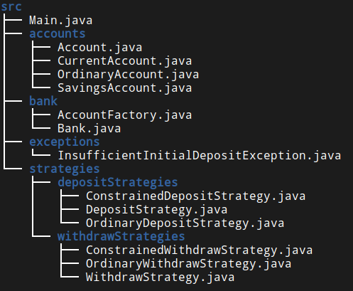

# SimpleBankingApp

## Problem
The problem is stated [here](docs/problem_spec.pdf)

## Introduction
Here I have implemented **Simpleton** structure in `Bank` class. I have also added **Factory** pattern in Account generation method \(class `AccountFactory`\). Introduction of **Strategy** pattern in deposit and withdrawal action
added a glimpse of modularity.

## Class Diagram

## File Structure

